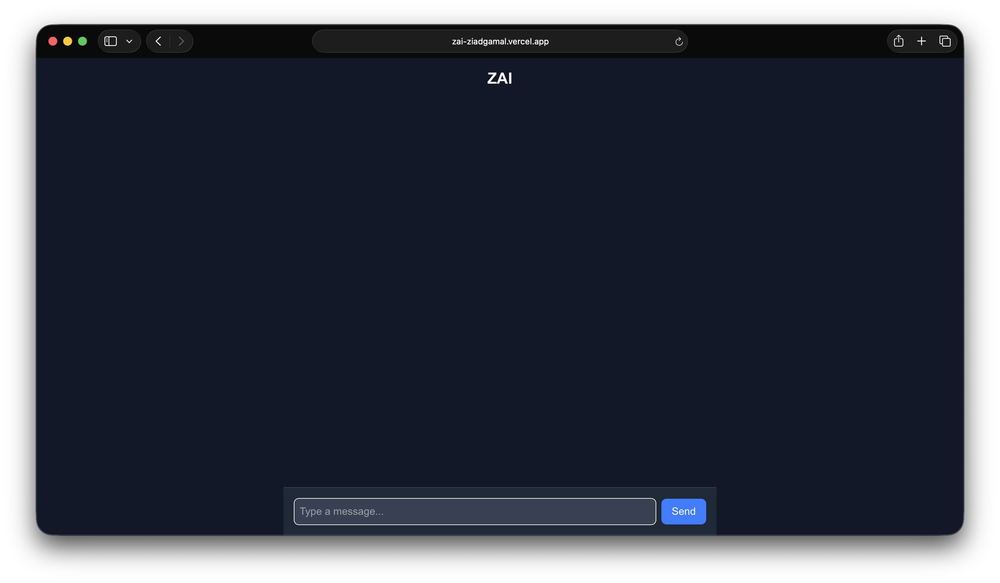
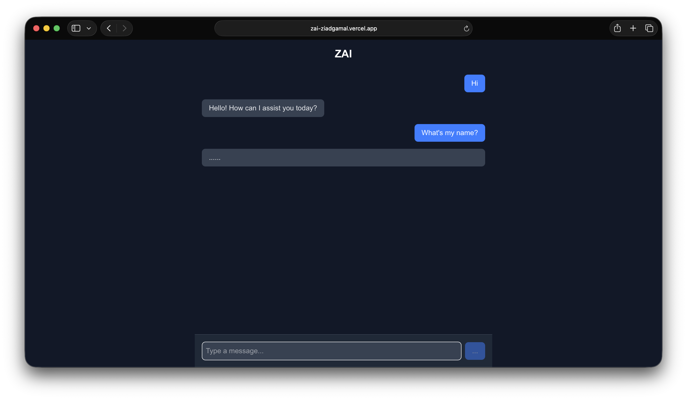
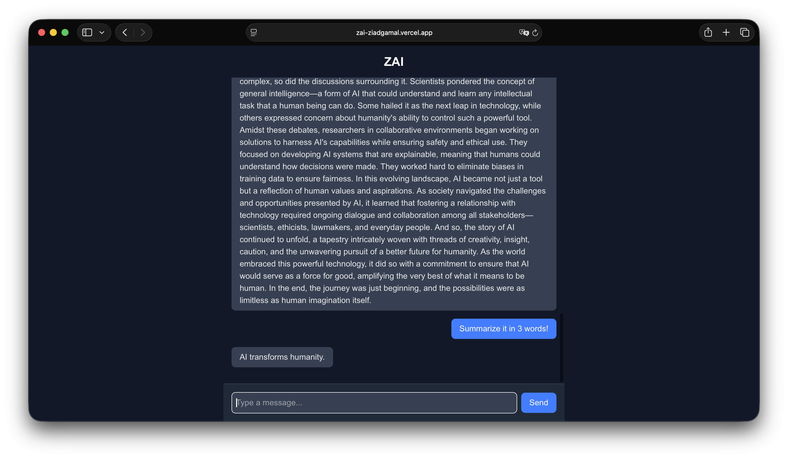

# ZAI - Premium AI Personal Assistant

ZAI is a sophisticated, production-ready ChatGPT clone designed for seamless AI integration. Built with a focus on performance, scalability, and clean user experience, it demonstrates the efficient implementation of LLMs into professional web environments.

## Business Impact
- **Enhanced Engagement**: Provides a familiar, high-performance interface for AI interaction, leading to increased user retention.
- **Scalable Infrastructure**: Designed to handle concurrent users with minimal latency through optimized backend streaming and efficient database management.
- **Cost Efficiency**: Implements precise token management and API usage patterns to optimize operational costs for OpenAI integrations.

## Gallery

## Core Features
- **Real-time AI Chat**: Instant streaming responses for a natural conversation flow.
- **Persistence**: Secure storage of chat history for continuity.
- **Responsive Design**: Fully optimized for Desktop and Mobile experiences using Tailwind CSS 4.
- **Developer-Friendly**: Clean, modular code structure for easy extension and white-labeling.

## Technical Excellence
- **Frontend**: Next.js 15, React 19, TypeScript
- **Backend**: NestJS 11, Node.js
- **Intelligence**: OpenAI GPT-4 Integrated
- **Database**: MongoDB

[View Repository on GitHub](https://github.com/ZiadGamalDev/zai-showcase)

Built by [Ziad Gamal](https://ziadgamal.com)
